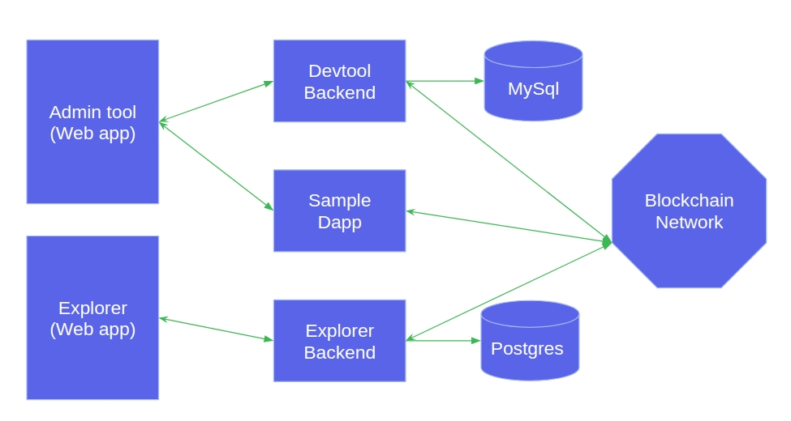

# Akachain Development Tool

This document guides how to use Akachain development tool (ADT)

Please flow this link to setup environment if ADT is not installed [github.com/akachain/devtool](https://github.com/Akachain/devtool)

## Table of Contents

  - [Create network](#create-network)
  - [Install chaincode](#install-chaincode)
  - [Chaincode development](#chaincode-development)
  - [Contact infomation](#contact-information)

## Create Network

Devtool consists of following components:
- Blockchain network: Blockchain network is based on Hyperledger Fabric. It can be customized when created using admin tool (create network). Each blockchain network contains the following components:
  - Peers (currently we support two peers)
  - CA: Certificate Authority
  - Orderer: Currently We support Solo orderer type. Raft and Kafka will be supported soon
- Dapp template: Decentralized application template to work with blockchain (It is integrated with devtool backend)
- Admin tool: To manage blockchain network (define network/delete network), Install/update/init/query chaincode.
- Blockchain explorer: To explorer everything on blockchain
- Postgres/Mysql: are databases that running on container serving devtool backend and explorer

## Install Chaincode
All chaincode files, libraries should be zipped to one *.zip file. To install chaincode, click the *Your chaincode* tab on the left pannel. Chose chaincode and then click the *Upload Chaincode* button. If chaincode is succesfully installed, It will be added to the chaicode list. It fail, an error message will be returned.

Chaincode must be initialized before used. To init chaincode, select chaincode in the chaincode list. When the chaincode detail page appear, click on *Init* tab, provide initial params and click *Init submit* button. The *Init status* in chaincode list indicates if the chaincode initializes success or not.

## Chaincode Development
Please follow the link below to learn how to develop a chaincode 

[Akachain chaincode developement](https://akc-assets.s3-ap-southeast-1.amazonaws.com/documents/AKC_Chaincode_guideline.pdf)

[Hyperledger chaincode development](https://hyperledger-fabric.readthedocs.io/en/release-1.4/tutorials.html)

## Contact Information
- Support team: [support@akchain.io](mailto:support@akachain.io)
- Dev team: [Henry Nguyen](mailto:longnv27@fsoft.com.vn), [Eledra Nguyen](mailto:longnv35@fsoft.com.vn)
- Website: [akachain.io](https://akachain.io)
